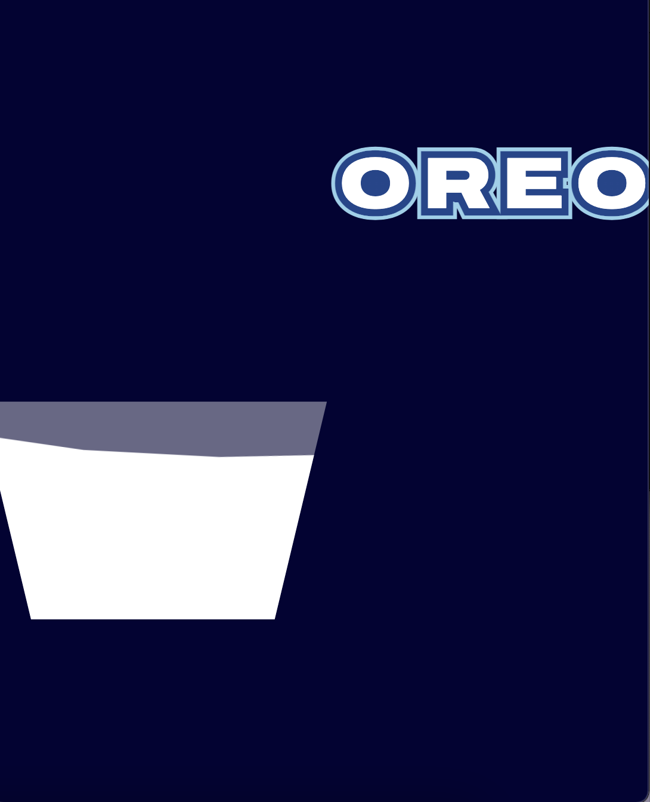

# Procesverslag
**Auteur:** Cherlyn Faré

**De opdrachten:** [opdracht 1](opdracht1/index.html) en [opdracht 2](opdracht2/index.html)

Markdown is een simpele manier om HTML te schrijven.  
Markdown cheat cheet: [Hulp bij het schrijven van Markdown](https://github.com/adam-p/markdown-here/wiki/Markdown-Cheatsheet).

Nb. De standaardstructuur en de spartaanse opmaak van de README.md zijn helemaal prima. Het gaat om de inhoud van je procesverslag. Besteedt de tijd voor pracht en praal aan je website.

Nb. Door *open* toe te voegen aan een *details* element kun je deze standaard open zetten. Fijn om dat steeds voor de relevante stuk(ken) te doen.

## Bronnenlijst
  1. Link code van letters: https://codepen.io/shooft/pen/rNqmqga
  2. Link code van glas melk: https://codepen.io/Spate/pen/gOGJMgG
  3. Link van font: https://fonts.googleapis.com/css2?family=Archivo:wdth,wght@125,900&display=swap

## Opdracht 1 plan

  
Uitwerken na schetsen idee (voor week 2)

  ### Je storyboard:
  
  

  ### Je ambitie: 
  Aan deze technieken/punten wil ik werken:
  - Volledig animeren met CSS
  - Visuals creëren met CSS
  - Complexere CSS kunnen gebruiken en begrijpen
 

## Opdracht 1 reflectie

  
Uitwerken bij afronden opdracht (voor week 4)

  ### Je uitkomst - karakteristiek screenshot(s):
  

  

  

  ### Dit ging goed/Heb ik geleerd: 
  Het 1 voor 1 dippen van de letters in het glas melk ging goed en soepel.
  Om dit te doen heb ik elke letter een delay gegeven en heb ik geleerd hoe je zo'n animatie kan maken.

  

  ### Dit was lastig/Is niet gelukt:
  Korte omschrijving met plaatje(s)
  Ik wou dat het glas melk van beneden naar boven in beeld kwam en dat lukte op een kleine scherm maar op een groot scherm niet. Op een groot scherm stonden alle spans naast elkaar en lukte het mij niet om het glas onder de letters te krijgen.

  De letters laten afruipen na het dippen lukte mij ook niet, want ik kwam er niet uit hoe ik dat moest doen.

  

  Verder is het wel responsive, maar bij een bepaald scherm formaat verschuifd het werk even en daarna staat het weer goed. 
  

## Opdracht 2 plan

  
uitwerken na schetsen idee (voor week 5)

  ### Je ontwerp:
  

  ### Je ambitie: 
  Aan deze technieken/punten wil ik werken:
  - punt 1
  - punt 2
  - nog een punt
  - ...

## Opdracht 2 test

  
uitwerken na testen (week 7)

  Neem minimaal 5 bevindingen op:

  ### Bevinding 1:
  Omschrijving van wat er nog niet orde was (tekst en afbeeding(en)).

  #### oplossing:
  Beschrijving hoe je het hebt hebt opgelost of als het niet gelukt is hoe je het zou oplossen (tekst en afbeeding(en)).

  ### Bevinding 2:
  Omschrijving van wat er nog niet orde was (tekst en afbeeding(en)).

  #### oplossing:
  Beschrijving hoe je het hebt hebt opgelost of als het niet gelukt is hoe je het zou oplossen (tekst en afbeeding(en)).

  ### Bevinding 3:
  ...

## Opdracht 2 reflectie

  
uitwerken bij afronden opdracht (voor week 8)

  ### Je uitkomst - karakteristiek screenshot(s):
  

  ### Dit ging goed/Heb ik geleerd: 
  Korte omschrijving met plaatje(s)

  

  ### Dit was lastig/Is niet gelukt:
  Korte omschrijving met plaatje(s)

  

