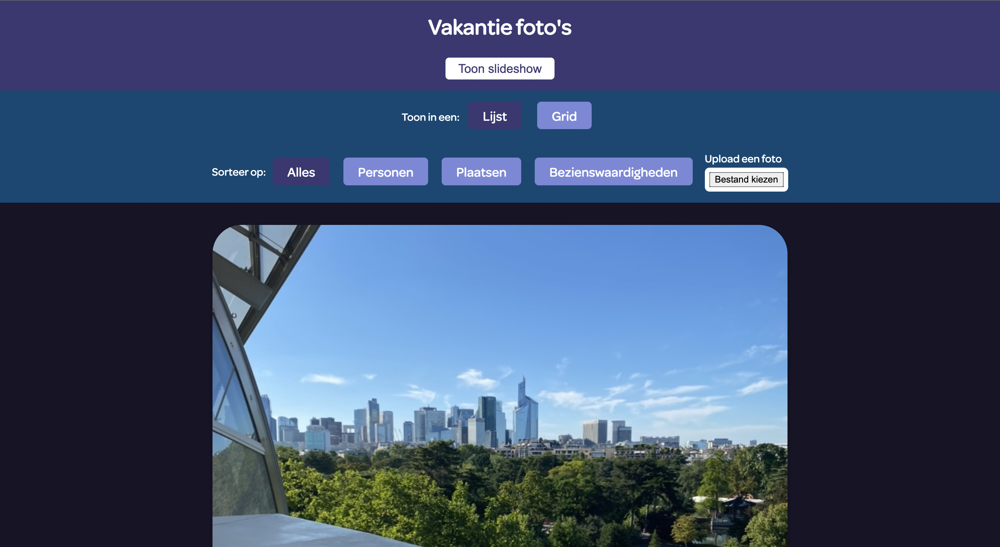
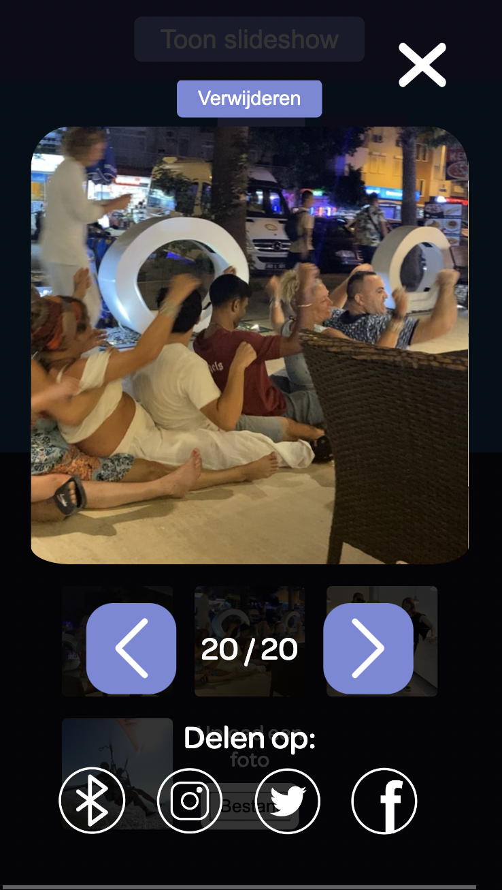
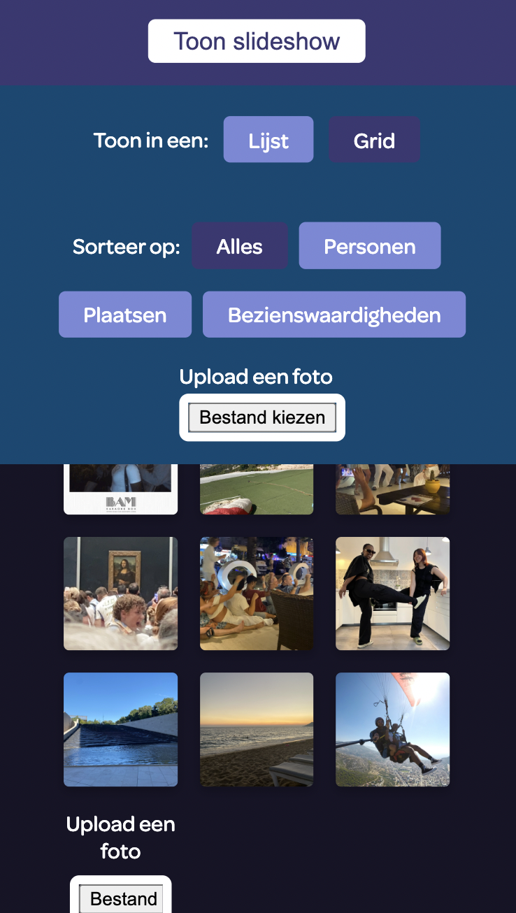
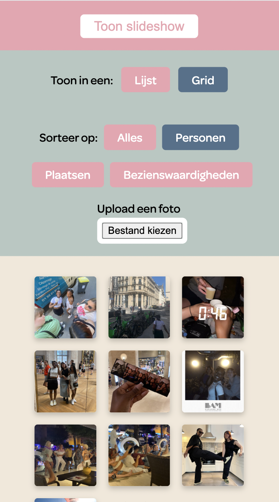

# Procesverslag
**Auteur:** Cherlyn Faré

**De opdrachten:** [opdracht 1](opdracht1/index.html) en [opdracht 2](opdracht2/index.html)

Markdown is een simpele manier om HTML te schrijven.  
Markdown cheat cheet: [Hulp bij het schrijven van Markdown](https://github.com/adam-p/markdown-here/wiki/Markdown-Cheatsheet).

Nb. De standaardstructuur en de spartaanse opmaak van de README.md zijn helemaal prima. Het gaat om de inhoud van je procesverslag. Besteedt de tijd voor pracht en praal aan je website.

Nb. Door *open* toe te voegen aan een *details* element kun je deze standaard open zetten. Fijn om dat steeds voor de relevante stuk(ken) te doen.

## Bronnenlijst
  1. Link code van letters: https://codepen.io/shooft/pen/rNqmqga
  2. Link code van glas melk: https://codepen.io/Spate/pen/gOGJMgG
  3. Link van font: https://fonts.googleapis.com/css2?family=Archivo:wdth,wght@125,900&display=swap
  4. Link stylesheet voor carousel: https://cdn.jsdelivr.net/npm/swiper@9/swiper-bundle.min.css
  5. Link Javascript voor carousel in HTML: https://cdn.jsdelivr.net/npm/swiper@9/swiper-bundle.min.js
  6. Link Javascript voor carousel: https://codepen.io/shooft/pen/GRXMEoV 
  7. Link splash screen: https://dev.to/saikatbishal/how-to-make-a-splash-screen-using-html-css-and-javascript-240m
  8. Link code voor gridview: https://codepen.io/shooft/pen/BaOwRBq
  9. Link code voor filters: https://codepen.io/shooft/pen/bGxoWNO 

## Opdracht 1 plan

  
Uitwerken na schetsen idee (voor week 2)

  ### Je storyboard:
  
  

  ### Je ambitie: 
  Aan deze technieken/punten wil ik werken:
  - Volledig animeren met CSS
  - Visuals creëren met CSS
  - Complexere CSS kunnen gebruiken en begrijpen
 

## Opdracht 1 reflectie

  
Uitwerken bij afronden opdracht (voor week 4)

  ### Je uitkomst - karakteristiek screenshot(s):
  

  

  

  ### Dit ging goed/Heb ik geleerd: 
  Het 1 voor 1 dippen van de letters in het glas melk ging goed en soepel.
  Om dit te doen heb ik elke letter een delay gegeven en heb ik geleerd hoe je zo'n animatie kan maken.

  

  ### Dit was lastig/Is niet gelukt:
  Korte omschrijving met plaatje(s)
  Ik wou dat het glas melk van beneden naar boven in beeld kwam en dat lukte op een kleine scherm maar op een groot scherm niet. Op een groot scherm stonden alle spans naast elkaar en lukte het mij niet om het glas onder de letters te krijgen.

  De letters laten afruipen na het dippen lukte mij ook niet, want ik kwam er niet uit hoe ik dat moest doen.

  

  Verder is het wel responsive, maar bij een bepaald scherm formaat verschuifd het werk even en daarna staat het weer goed. 
  

## Opdracht 2 plan

  
uitwerken na schetsen idee (voor week 5)

  ### Je ontwerp:
  

  ### Je ambitie: 
  Aan deze technieken/punten wil ik werken:
  - Kunnen filteren en sorteren
  - Javascript beter begrijpen
  - Een goede responsive pagina maken

## Opdracht 2 test

  
uitwerken na testen (week 7)

  ### Bevinding 1:
  Het sorteren van de foto's door de view te veranderen werkte goed. Als je op één van de radio buttons klikt, kan je de foto's in een lijst of grid view bekijken zonder probleem. Ook zijn de lijst en grid view responsive.
  
 

  #### oplossing:
  Geen oplossing

  ### Bevinding 2:
  De pagina is goed responsive en alle foto's in de twee verschillende views schalen zonder problemen mee. Ik heb wel als suggestie gekregen om de radio buttons te stijlen.
  
 
  
  #### oplossing:
  Ik heb de radio buttons compleet gestijlt en ziet het qua ontwerp er nu beter uit.
  

  ### Bevinding 3:
  Tussen de header en filters probeerde ik een carousel te plaatsen, maar de code werkte niet en zag je daarom een lege plek.
  

  #### oplossing:
  Ik heb de code gebruikt van dlo en het probleem was dat ik de script die ik moest kopiëren op de verkeerde plaats in de html had gezet. De script moest boven mijn eigen script geplaatst worden om het te laten werken.
  
  

  ### Bevinding 4:
  Ik heb verder niet veel kunnen testen, omdat ik nog niet zo ver was en je alleen kon filteren en sorteren.
  

  #### oplossing:
  Ik heb verschillende animaties, micro-interacties en user interface events toegevoegd aan mijn ontwerp na de test. De buttons hebben verschillende states, er is een loading state met een progress bar en een empty state.
  
  
  

  ### Bevinding 5:
  De mappen had ik niet goed in github gezet, waardoor je een pagina zag zonder css stijling en alleen de html zag. Hierdoor kon de test persoon de pagina alleen op mijn laptop bekijken.
  

  #### oplossing:
  Ik heb een nieuwe repositorie moeten aanmaken en opnieuw de mappen erin moeten doen, want bij de eerste werkte het nog steeds niet. Nu werkt het wel!
  

## Opdracht 2 reflectie

  
uitwerken bij afronden opdracht (voor week 8)

  ### Je uitkomst - karakteristiek screenshot(s):
  Ik ben best tevreden met het eindresultaat en het ontwerp dat ik heb gemaakt is grotendeels gelukt met extra hulp van de docent.

  De vormgeving van de pagina vind ik goed gelukt en je ziet duidelijk een verschil tussen light en dark mode. Het is volledig responsive en de foto’s schalen goed mee door het gebruik van een grid. Verder heb ik veel micro interacties toegevoegd, zoals de verschillende states bij de knoppen en is het gebruiksvriendelijk. Je kan er makkelijk doorheen klikken, tabben en de carousel zelfs swipen. Het is nu ook veel duidelijker waarvoor deze pagina gebruikt kan worden en voorheen was dat niet zo. Zelf vindt ik JS lastig, maar nu ik de code zo lees begrijp ik het wel beter.

  
  
  
  

  ### Dit ging goed/Heb ik geleerd: 
  De pagina is responsive en de foto's schalen goed mee. Ik heb ook beter leren werken met grids.
  
  

  Ik vind dat de animatie voor de laadbalk goed gelukt is en het laden verloopt soepel door het gebruik van keyframes.
  

  ### Dit was lastig/Is niet gelukt:
  Als je een foto wil uploaden via de lijst zelf zie je de foto’s niet in beeld verschijnen, maar het lukt wel via de upload knop in de “navigatie”. Waarschijnlijk heb ik iets verkeerds geschreven in de JS, maar ik ben er niet uitgekomen.
  

  Wat ook niet helemaal gelukt is, is de terug en volgende knop van de carousel naast de teller te zetten. Het is wel gelukt op een klein scherm door media query’s te gebruiken, maar tijdens het schalen van het scherm gingen de knoppen steeds mee bewegen. Hetzelfde probleem had ik ook met de verwijder knop.
  
  

  De bedoeling bij het laadscherm was dat na dat de progressbar geladen was en er een knop te voorschijn kwam, de gebruiker op moest klikt om de foto's te bekijken. Wat er nu gebeurt is dat de gebruiker tijdens het laden al kan klikken en dat is niet de bedoeling. Ik heb geen idee hoe ik het met JS moet oplossen, dus heb ik bij de cursor "wait" gezet om de gebruiker te laten denken dat ze niet kunnen klikken en moeten wachten op de knop.
  
  

